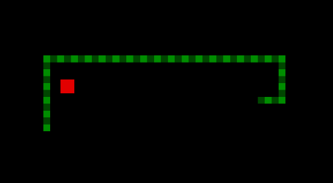

# Sznake

[PLAY HERE](https://mateusz.github.io/sznake/static/index.html)

A very simple snake game, cross-compiled to WASM and served via browser for all the Nokia 6210 and BASIC lovers out there (tested on Firefox on MacOS, Linux and Windows).

Rules:

* Control the snake with arrow keys.
* You have limited time to grab the apple or the snake will fade away and die! The snake gets hungry quickly.
* If you crash, the snake turns yellow - but you still have a few seconds to recover before it dies for good!
